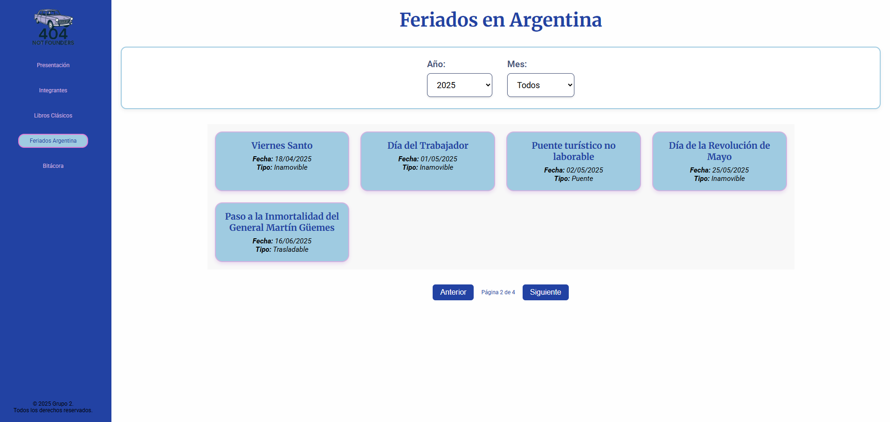
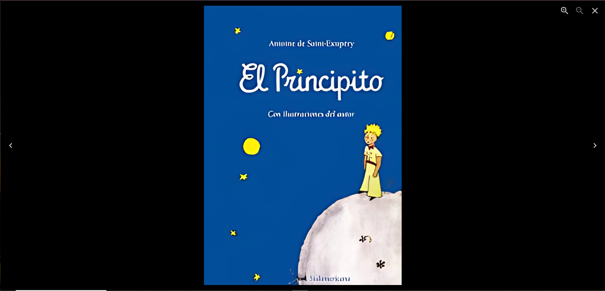
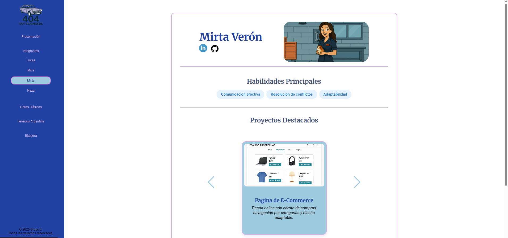
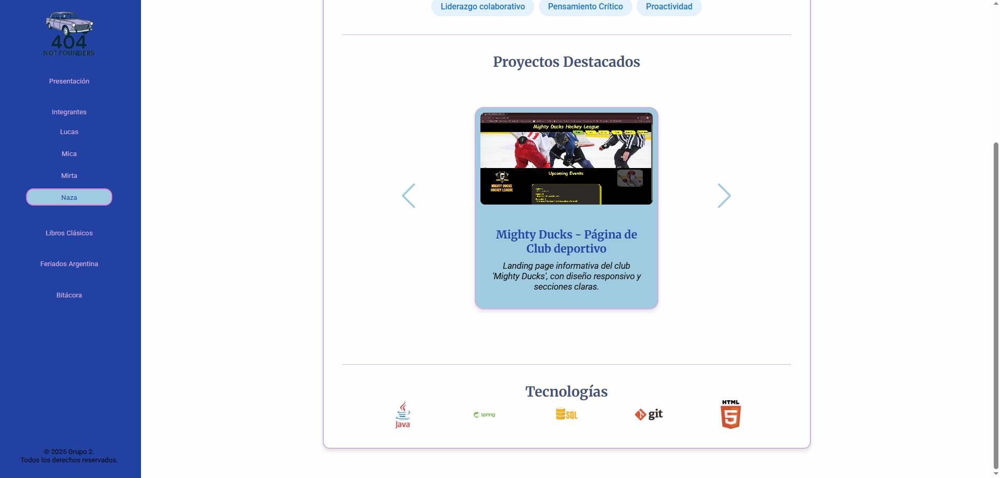

# 🧩 Proyecto React - TP Grupal 1 - Segunda Entrega

Este repositorio corresponde a la segunda entrega del **Trabajo Práctico Grupal N.º 1**, partiendo del desarrollo original de una **SPA (Single Page Application)** realizada con **React** y **React Router**. En esta etapa, nos propusimos **evolucionar el proyecto** incorporando nuevas funcionalidades interactivas y mejoras sugeridas por el equipo docente y el propio grupo.

---

## 🎯 Objetivo de la Segunda Entrega

Implementar al menos **4 nuevas funcionalidades** a partir del listado propuesto para enriquecer la experiencia del usuario y demostrar dominio técnico en:

- Manejo de rutas y estado
- Interacción con APIs
- Diseño UX/UI
- Componentización avanzada
- Buenas prácticas en desarrollo front-end

---

## ✅ Mejoras elegidas para implementar

- 🔁 **Paginación para la API Externa**  Por Lucas ✅
  Navegación entre páginas de resultados con botones Anterior / Siguiente y visualización de número de página actual.

- 🖼️ **Galería de Imágenes Interactiva**  Por Mica ✅
  Grid de imágenes con lightbox al hacer clic, zoom y navegación dentro de la galería.

- 🔗 **Botones de Redes Sociales Animados**  Por Mirta ✅
  Íconos interactivos con efectos al hover y enlaces ficticios a GitHub, LinkedIn, etc.

- 🎠 **Carrusel de Proyectos Destacados** Por Naza ✅  
  Carrusel responsive con controles de navegación para explorar proyectos del equipo.

---

## 📸 Capturas de Pantalla

*(Las siguientes capturas corresponden al nuevo desarrollo incorporado en esta segunda entrega)*

### 🔁 Paginación de la API


### 🖼️ Galería Interactiva


### 🔗 Redes Sociales


### 🎠 Carrusel de Proyectos


---

## 🚀 Deploy

🔗 Link a la app en Vercel: _[https://ifts-29-frontend-tp-1-grup-part2.vercel.app/](https://ifts-29-frontend-tp-1-grup-part2.vercel.app/)_

---

## 📁 Repositorio Original

🔗 Repositorio base del proyecto original (Primera Entrega):  
_[https://github.com/Gabycrem/IFTS29-Frontend-TP1-Grup](https://github.com/Gabycrem/IFTS29-Frontend-TP1-Grup)_
---

## 👥 Integrantes

- Micaela Natalia Luaces – Diseño e Identidad Visual.  
- Lucas Ezequiel Blaci – Integración de datos.  
- Nazarena Gabriela Macre – Liderazgo y Coordinación General.  
- Mirta Veron – Perfiles dinámicos y nuevas vistas.

---

## ⚙️ Tecnologías y Herramientas

- ⚛️ React + Vite  
- 🧭 React Router DOM  
- 🎨 CSS Modules  
- 📄 JSON  
- ☁️ Vercel  
- 💻 GitHub  
- 📋 Trello  
- 💬 Discord  

---

## 🌲 Estructura del Proyecto (actualizada)

🌲 Estructura del Proyecto (actualizada)
```
src/
├── components/
│   ├── Layout.jsx
│   ├── Sidebar.jsx
│   ├── Carrusel.jsx
│   ├── Galeria.jsx
│   ├── PaginacionAPI.jsx
│   ├── RedesSociales.jsx
│   ├── PresentacionEquipo.jsx
│   ├── ListaAPI.jsx
│   └── Perfil.jsx
├── data/
│   └── libros.json
├── pages/
│   ├── Home.jsx
│   ├── Equipo.jsx
│   ├── Comentarios.jsx
│   └── Proyectos.jsx
├── App.jsx
├── main.jsx
├── index.css
└── styles/
    └── global.css
```
---


## 📌 Estado del Proyecto

✅ Estructura base clonada  
✅ Nuevas funcionalidades integradas  
✅ Estilos actualizados y mejoras UX  
✅ Documentación completa  
✅ Deploy en producción

---


## 📈 Futuras Mejoras

- 🌙 **Modo oscuro**  
- 🔎 **Buscador por título/autor en lista de libros**  
- 💌 **Formulario de contacto funcional con validaciones**  
- 📂 **Separación de componentes reutilizables en carpetas**  
- 🌐 **Soporte multilenguaje**

---


## 📌 Notas Finales

Esta segunda etapa del proyecto nos permitió profundizar en conceptos clave del desarrollo con React, mejorar nuestras habilidades de colaboración y enfrentar desafíos técnicos con una planificación clara. Continuamos aprendiendo a través de la práctica y consolidando nuestra experiencia en el desarrollo de aplicaciones web modernas.
